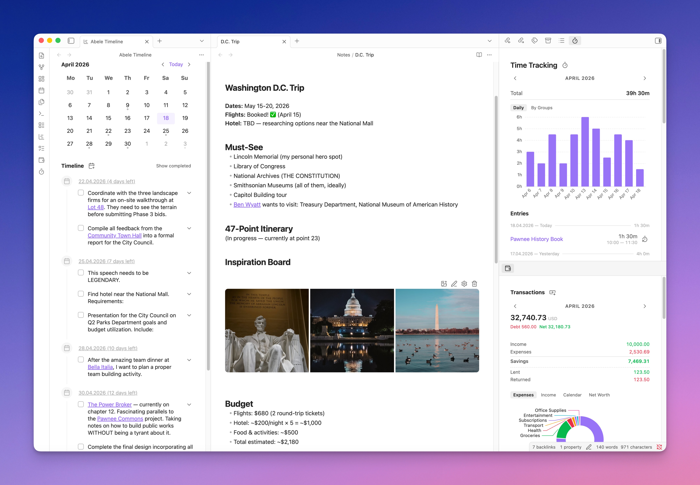

# Ābele Obsidian plugin



An Obsidian plugin that adds a lot of functionality I personally find missing:

- Tasks
- Calendar
- Journals
- Logs
- Templates
- Financial Tracker
- Time Tracker
- Image Galleries
- AI Agent
- Various helper tools, etc.

I've been working on this plugin for several years. Originally, it was more of a collection of helpers that were hard to adapt to workflows different from my own. It was also heavily dependent on the Dataview API. Recently, I decided to rewrite it from scratch to make it more universal and as independent as possible from other plugins. My goal is to consolidate all the functionality I need into a single plugin.

The plugin has been tested on a vault with over 16k notes on both desktop and iOS.

## Features

Currently, the plugin has the following features.

### Logs

This is the first and probably the most important feature for my Obsidian workflow. Logs are individual paragraphs or entire notes that are displayed in full, in chronological order, within related notes. I write most of my notes in daily notes. For example, I can write something like:

```
Met with [[John]] and [[Anna]] at [[Coffee House]], then went to the movies to watch [[Interstellar]]
```

and this entry will appear in the timeline of each linked note — `[[John]]`, `[[Anna]]`, `[[Coffee House]]`, and `[[Interstellar]]` — so when I visit them, I'll know the context and when I interacted with them.

What's also important is the cross-linking of logs, tasks, and other notes. My notes are grouped using the frontmatter property `groups`. For example, `[[Interstellar]]` would have a `groups` link to `[[Movies]]`, and if I visit Movies, I'll see in chronological order which movies I watched and when, along with the context.

As mentioned above, logs can be individual paragraphs or entire notes. If a link to a related note is only in the note's text, only that paragraph will be displayed in the logs of the related note. But you can make an entire note a log by linking it via the `groups` property. This is how I write meeting reports, for example, since they usually span more than one paragraph.

### Tasks

There are many ways to manage tasks in Obsidian. I used to use the excellent Tasks plugin, which treated markdown checkboxes as tasks and allowed managing them via Dataview. It was generally convenient, and its functionality was enough for me for a long time, but eventually I decided to switch to a more Obsidian-native approach.

In Ābele, tasks are notes. All their information — deadlines, completion status, creation date, etc. — is stored in their properties. Tasks are displayed in several ways: in the general timeline, in related notes, in daily notes, and as a general list. I intentionally avoided complicating them with priorities, nesting, tags, etc., as I find these distracting. I currently have over 1000 tasks (both open and closed) in Obsidian, and I no longer maintain any other personal task lists anywhere. I find this approach maximally effective.

Having tasks as separate notes allows for very detailed descriptions, attaching all necessary information. The automatic title setting makes it possible to write titles with links to other notes, so the task appears in all relevant contexts.

### Journals

Besides daily notes, I keep monthly and yearly ones, as well as a separate daily health journal where I collect data exported from Apple Health — and I don't want to mix it with my main journal. To manage them effectively, navigate between adjacent notes, quickly create them, and have quick access to them, I developed the journals functionality. It groups notes belonging to one journal, automatically creates them using configurable paths for each journal, allows switching between multiple journals for a specific date, opens them via calendar click, and shows which dates have journal notes and open tasks.

### Financial Tracker

This is a relatively new feature of the plugin. I previously used Firefly III, but I missed the linking capabilities that Obsidian provides and wanted a simpler way to create transactions. Firefly's analytics were also rather inconvenient. All of this led to a natural conclusion — adding financial tracking support directly in Obsidian.

Each transaction is a separate file with `from`, `to`, amount, and currency specified in its properties. `From` and `To` are simply links to account notes, which come in the following types: assets, income, expenses, and liabilities. Depending on the account types, a transaction is counted as positive, negative, or neutral (for transfers between wallets) in the overall balance.

Transaction lists and analytics are available in the finance sidebar, in all account notes, and in all notes referenced by a transaction.

The module supports multi-currency operations in the same way Firefly does — by specifying the amount in two currencies.

### Time Tracker

The time tracker serves as my replacement for Toggl. It's conceptually very similar to the financial module, except instead of transactions there are time entries. Each time entry has a start and end time, as well as a `groups` property that links to the note being tracked. It follows the same Obsidian-native approach where one time entry = one file.

As with finances, the list of time entries can be viewed in the sidebar and in all notes linked to time entries, as well as their groups and so on up the tree. This means if you have tasks under a project and you track time against them, the project note will display the total time spent on it.

For reports, I use the built-in Bases functionality, which allows exporting a ready-made CSV file for all tasks and projects.

### AI Agent

My goal was never to create a new Claude Code or a full-fledged replacement inside Obsidian. The main reason I decided to embed an agent chat in Obsidian is that I want fine-grained control over file access that I grant to agents. Since my file structure is flat, simply granting access to a folder wouldn't work.

Instead, I implemented a very flexible access system with a virtual filesystem for agents. You can grant access to individual files, folders, patterns, and — most importantly — entire branches of files linked through the `groups` property. For example, you can grant access to a "My Project" group, and all notes referencing that project through `groups`, as well as all their sub-notes and so on, will be accessible to the agent.

To enable the agent to work with Obsidian, it has basic file operation tools, web search (via Brave Search), fetch, image reading/generating, and various other essential capabilities.

There is also support for skills and a prompt library. My favorite skill is probably "defuddle", which teaches the agent how to load website content efficiently, directly in markdown format.

### Images Gallery

Another long-standing pain point in my Obsidian workflow — working with images — is solved by this module. You can conveniently add and manage image display within notes, move them, edit them, and much more.

### Charts Bases View

Since my Obsidian vault contains a lot of numerical data (finances, time tracking, and beyond), I wanted to be able to visualize it as charts to see trends, correlations, and analytics. And since I already had to add charts for other modules, I added a new Obsidian Bases View type for charts.

You can build various types of charts using any data from your notes.

### Templates

For templates, I used to use the powerful Templater plugin for Obsidian. Personally, I didn't find it very convenient, and it seemed unsafe since it executed JS directly from notes. I wanted a more lightweight solution with more convenient template selection, so I wrote my own templating implementation.

Over time, templates became used across all other modules, becoming an important foundation of the entire plugin.

### Find and replace

In addition to the above functionality, the plugin also includes a very powerful find-and-replace tool for note contents. I created it to facilitate vault migration between different structures.

When I first started using Obsidian, out of habit I created many different root and nested folders, trying to organize my vault that way. But over time, I started relying heavily on internal links and increasingly navigated to notes from the context of other notes. I also read [@kepano's approach](https://stephango.com/vault) to organizing his vault and decided to switch to an almost completely flat structure. Almost all my notes (except journal ones, located in `Journals/YYYY` folders) are in a single `Notes` folder. At the time of migration, my vault had around 6000 notes, so I needed a flexible tool that could bulk-update note properties based on their directories, move them, add new properties (including link and list types), merge values of multiple properties, replace text in notes containing specific properties, and much more.

For these purposes, I wrote the find-and-replace module, which works with conditions, allows smart frontmatter property replacement, and much more.

## Roadmap

Currently, the plan includes some refactoring and performance optimization, plus fixing known bugs.

## Development approach

The original version of the plugin, its architecture, and all core functionality — including logs, journals, tasks, timeline, templates, find and replace, and most of the UI and helpers — were written entirely by hand. Over time, I started using LLMs more actively, including agents recently, as they've finally become reliable enough. So the plugin is now developed in part with the help of LLMs. I think it's important to mention this. That said, I review the code and periodically refactor it, and I always verify the plugin's functionality before pushing it here.

The plugin is currently in very active development, so bugs are expected. I also haven't written detailed documentation yet. However, if you want to try it and can't get it running, please open an Issue — I'll try to help.

## Documentation

Notes for anyone working on the plugin live in [`docs/`](docs):

- [Design](docs/Design.md) — the shared UI kit and the rules every screen follows.
- [Obsidian compliance](docs/Obsidian%20compliance.md) — the guidelines the plugin is held to, and where it knowingly departs from them.
- [Testing](docs/Testing.md) — the three test tiers, and how to assert against a running Obsidian.
- [AI Agent](docs/AI%20Agent.md) — agents, delegation and the scripting API.
- [Agent reference](docs/Agent%20reference.md) — the docs the agent itself reads, and the rules for keeping them true.
- [Templates](docs/Templates.md) and [URL Protocol](docs/URL%20Protocol.md).

## Installation

TODO

## License

[GPL-3.0](LICENSE)
