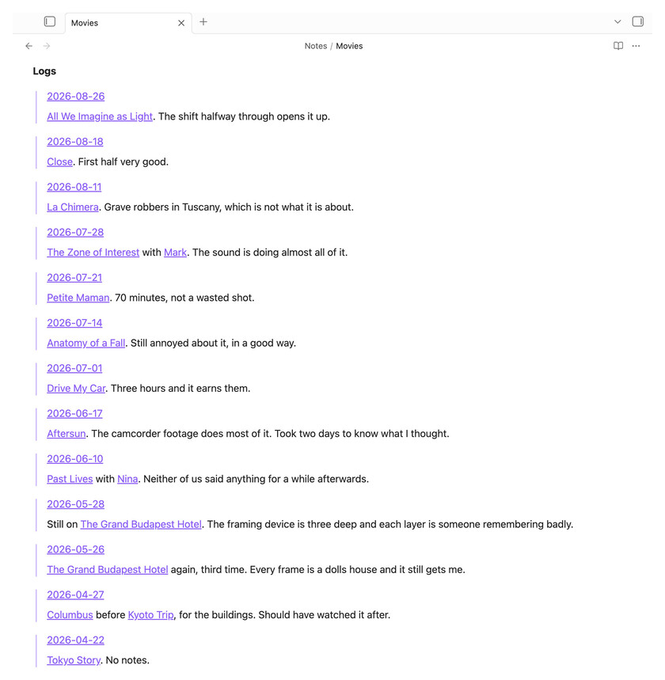
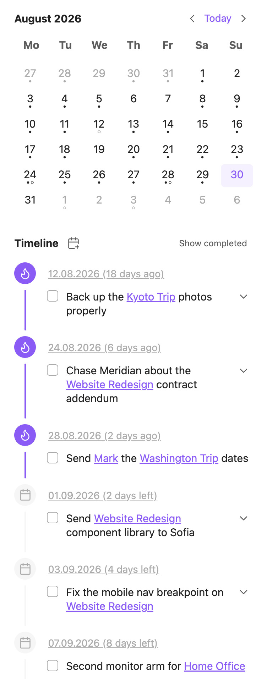
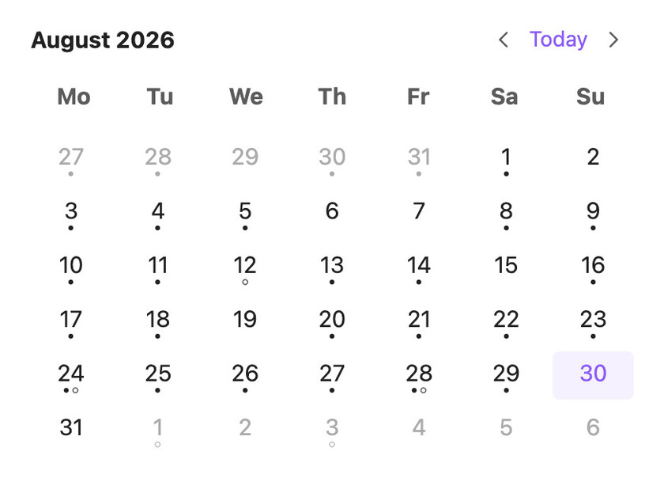
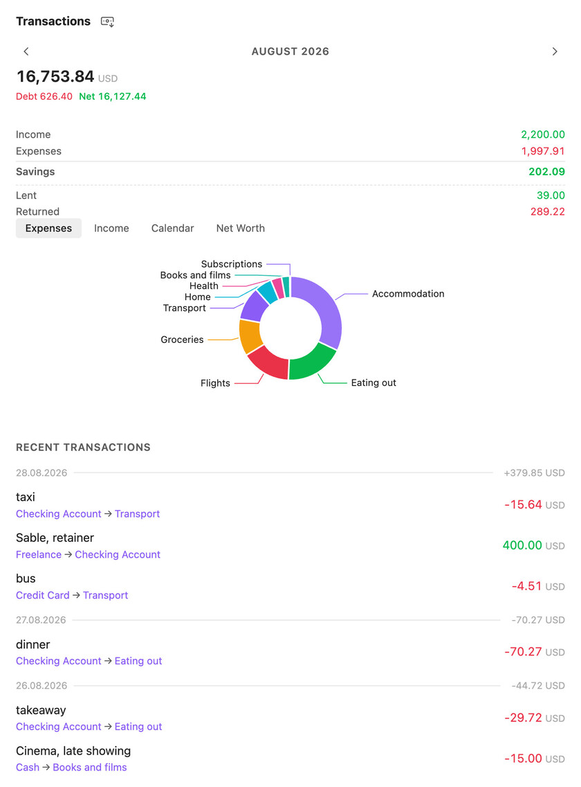
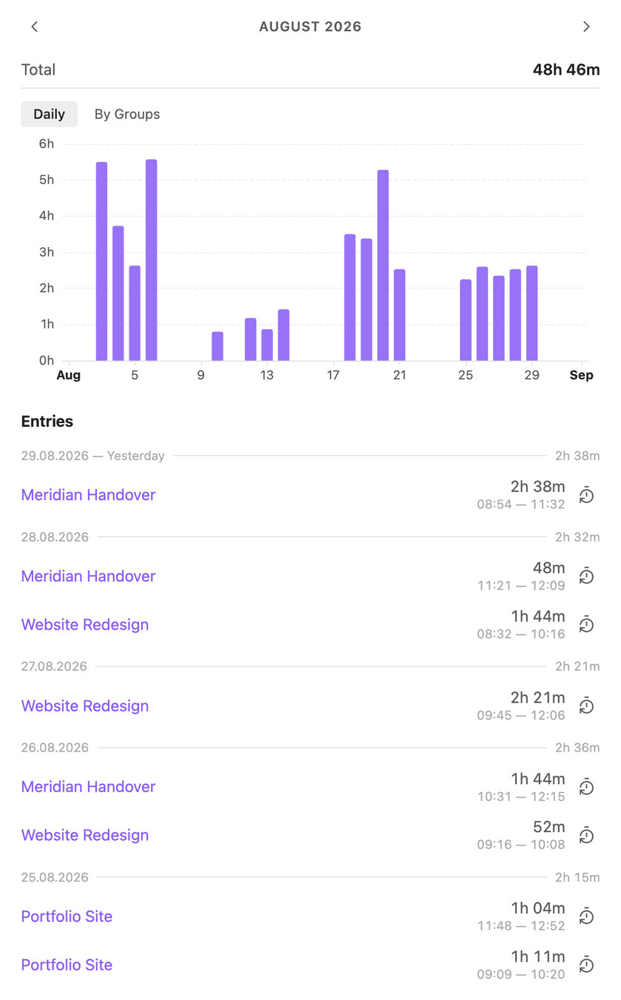
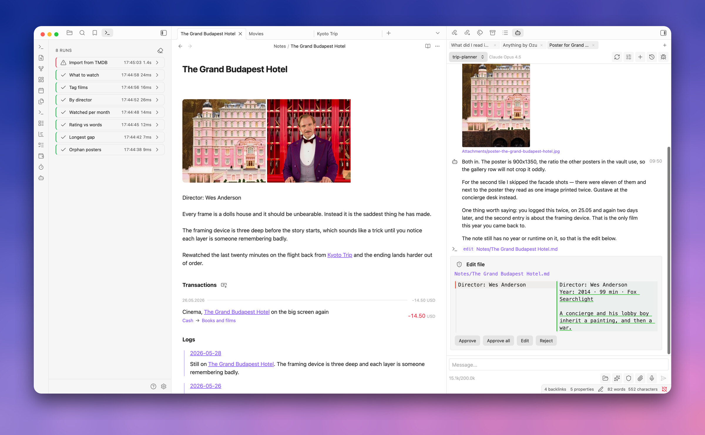

# Ābele Obsidian plugin


An Obsidian plugin that adds a lot of functionality I personally find missing:

- Logs
- Tasks
- Journals and Calendar
- Financial Tracker
- Time Tracker
- Image Galleries
- Charts
- Templates
- AI Agents
- Scripts
- Various helper tools, etc.

I've been working on this plugin for several years. It started as a collection of helpers that were hard to adapt to workflows other than my own, and it depended heavily on the Dataview API. I rewrote it from scratch to make it more universal and as independent of other plugins as possible. My goal is to consolidate all the functionality I need into a single plugin.

Everything in it is a note. A task is a note, a transaction is a note, a time entry is a note, and notes belong to each other through the `groups` frontmatter property. `groups` is a graph rather than a folder tree: a note can belong to several groups, and a group can belong to another group. Every list and every timeline in the plugin follows those links, and so does everything an agent is allowed to see.

Most of my recent work has gone into the last two items on that list. A script is plain JavaScript that runs inside Obsidian with the whole vault in scope, so anything the plugin doesn't do, I can write once and then run from a command, a note header, a link, or an agent. Agents and scripts are the part I'd point at first now. The rest of the plugin is what they're built on.

The plugin has been tested on a vault with over 16k notes on both desktop and iOS.

## Features

### Logs

The first and probably the most important feature for my Obsidian workflow. Logs are individual paragraphs or whole notes that appear in full, in chronological order, inside related notes. I write most of my notes in daily notes, so I can write something like:

```
Met with [[John]] and [[Anna]] at [[Coffee House]], then went to the movies to watch [[Interstellar]]
```

and this entry appears in the timeline of every linked note — `[[John]]`, `[[Anna]]`, `[[Coffee House]]`, `[[Interstellar]]` — so when I visit them, I know the context and when I interacted with them.

Logs cross-link through `groups` too. `[[Interstellar]]` has a `groups` link to `[[Movies]]`, so Movies shows which movies I watched and when, with the context. A link in a note's text contributes only that paragraph; a link in the `groups` property makes the whole note a log. That's how I write meeting reports, which rarely fit in one paragraph.



### Tasks

In Ābele, tasks are notes. Deadlines, completion status, creation date — all of it lives in their properties. Tasks appear in the general timeline, in related notes, in daily notes, and as a general list. I deliberately left out priorities, nesting and tags, since I find them distracting. I have over 1000 tasks in Obsidian now, open and closed, and I no longer keep a personal task list anywhere else.

Tasks being notes means a task can carry a long description and everything attached to it. Automatic title setting lets titles hold links to other notes, so a task appears in every relevant context.



### Journals and Calendar

Besides daily notes I keep monthly and yearly ones, plus a separate daily health journal for data exported from Apple Health, which I don't want mixed into my main journal. Journals group the notes belonging to one journal, create them from a configurable path, switch between several journals for the same date, open from a calendar click, and mark which dates have notes and open tasks.



### Financial Tracker

I used to use [Firefly III](https://www.firefly-iii.org), but I missed the linking Obsidian gives you, and creating a transaction there was more work than it should have been.

Each transaction is a separate file with `from`, `to`, amount and currency in its properties. `From` and `To` are links to account notes, which are assets, income, expenses or liabilities, and their types decide whether a transaction counts as positive, negative or neutral in the balance. Multi-currency works the way Firefly does it, by giving the amount in two currencies. Transaction lists and analytics appear in the finance sidebar, in account notes, and in every note a transaction links to.



### Time Tracker

The time tracker is my replacement for [Toggl](https://toggl.com), and conceptually it's the finance module with time entries instead of transactions. One entry is one file, with a start, an end, and a `groups` property pointing at whatever is being tracked.

Entries appear in the sidebar and in every note they link to, then in their groups, and so on up the tree — so if you track time against tasks under a project, the project note shows the total. For reports I use Obsidian's own Bases, which exports a CSV of all tasks and projects.



### Image Galleries

Working with images was a long-standing pain point in my Obsidian workflow. This module handles adding, arranging, moving and editing images inside a note.

### Charts

My vault holds a lot of numbers — finances, time tracking and beyond — and I wanted to see the trends in them. Charts are a new Obsidian Bases view type, and they build from any data in your notes.

### Templates

I used to use [Templater](https://github.com/SilentVoid13/Templater), which is powerful, but I didn't find it convenient, and I wanted something lighter and wired into the rest of the plugin rather than sitting beside it. So I wrote my own. Over time templates ended up used by every other module, and became one of the foundations of the plugin.

### AI Agents

My goal was never to build a new Claude Code inside Obsidian. What I wanted was fine-grained control over the file access I hand to an agent — my vault is flat, so granting access to a folder means nothing.

So access is a scope built from files, folders, patterns and, most usefully, groups. Grant an agent the "My Project" group and it gets every note linking to that project through `groups`, everything under those, and so on down the graph. If a path falls outside the scope, the tools refuse it.

An agent is a named configuration: a model and a fallback, a system prompt composed from text blocks and vault notes, which tools it may use and whether each one asks first, its scope, and how far it may delegate. A chat picks an agent, and can override the model, permissions or scope for itself without touching the agent. Utility agents stay out of the chat picker, to be called by scripts, delegation or message interceptors instead.

An agent with delegation depth above zero can hand a self-contained task to another agent, or fan the same task out over a list of items with one sub-agent per item. Every delegated run keeps its full transcript, readable inline in the chat or in its own tab.

To work with a vault, agents have file operations, search, the plugin's own relation tools (the logs, backlinks, tasks and transactions of a note), web search and fetch, image reading and generation, voice input, and the ability to run any script. There is also a prompt library and support for skills. My favorites are still ["defuddle"](https://github.com/kepano/defuddle), which teaches the agent to load a website straight into clean markdown, and "deepresearch", which has it dig into a topic iteratively, through web search and whatever other tools it has to hand.

Any of that can also be asked in place. Select a passage in a note, ask your question, and the chat opens on the margin beside it — anchored to that passage, scoped to that note, and able to edit the text it is about. It is an ordinary chat underneath, so when a question turns into work, open it in the sidebar and carry on there.



### Scripts

Skills are not deterministic. An agent follows one today and does something odd with it tomorrow, and for anything I want to happen the same way every time, that isn't good enough. So I wanted a way to build automations inside Obsidian, with agents and for agents, that runs predictably, and that the agents themselves can write for me.

A script is a JavaScript file in the vault that runs inside Obsidian with full vault access, and a comment header declaring its name, icon and parameters:

```js
// @name Tag untagged notes
// @description Finds notes without tags and adds one
// @icon tag
// @param tag string "Tag to add" = "todo"
```

Parameters become a form when a person runs the script, and arguments when an agent or another script calls it. In the body you get file operations, structured search, the template engine, `fetch`, forms and markdown modals, `dayjs`, and `agent()` — so a script can hand the fuzzy part of a job to a model and keep the rest exact. Whatever it logs becomes its output.

There are four ways to start one: the command palette, a button in a note's header that runs it against that note, an `abele://` link, or an agent calling it as a tool. Every run of the session is listed with its status, its log lines and what it returned, and can be stopped or run again from there.

### Find and replace

A find-and-replace tool for note contents, which I built for vault migration. Moving 6000 notes to an almost completely flat structure, following [@kepano's approach](https://stephango.com/vault), meant rewriting properties based on a note's directory, merging several properties into one, replacing text only in notes carrying a given property. So it works with conditions and handles frontmatter properly, rather than treating a note as text.

### Smaller things

- Deep links (`abele://`) that open a note, run a command, or run a script with parameters
- Footnote sidenotes, and colored highlights with `=={color} text==`
- Comment chats anchored to a passage, answered on the margin of the note
- CSS snippets loaded and hot-reloaded from a folder in the vault
- Settings transfer to another device — QR codes, a line of text, or a file — scripts, skills and prompts included

## Roadmap

Mostly agents right now, and bug fixes. I'm using the plugin to build custom learning systems for myself, which is how I keep finding out what it's missing. There will be more Bases views, and I hope for more capable APIs once Obsidian supports them.

## Development approach

The original version of the plugin, its architecture and all its core functionality — logs, journals, tasks, timeline, templates, find and replace, most of the UI and the helpers — were written entirely by hand. It isn't built that way anymore. I don't write the code now: development is fully agent-driven, and what I look at is the architecture rather than the implementation. To keep control over what the agents change, I've more or less moved to TDD. I still check that the plugin works before pushing it here, and I think all of this is worth saying plainly.

It's in very active development, so bugs are expected, and I haven't written detailed documentation yet. If you want to try it and can't get it running, open an Issue and I'll try to help.

## Documentation

Notes for anyone working on the plugin live in [`docs/`](docs):

- [Design](docs/Design.md) — the shared UI kit and the rules every screen follows.
- [Obsidian compliance](docs/Obsidian%20compliance.md) — the guidelines the plugin is held to, and where it knowingly departs from them.
- [Testing](docs/Testing.md) — the three test tiers, and how to assert against a running Obsidian.
- [AI Agent](docs/AI%20Agent.md) — agents, delegation and the scripting API.
- [Agent reference](docs/Agent%20reference.md) — the docs the agent itself reads, and the rules for keeping them true.
- [Script views](docs/Script%20views.md) — the tab a script can open and fill with an interface.
- [Templates](docs/Templates.md) and [URL Protocol](docs/URL%20Protocol.md).

## Installation

TODO

## License

[GPL-3.0](LICENSE)
