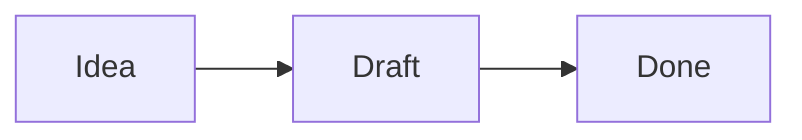

# Showing things

Whatever a note can show, a reply can show: galleries, diagrams, charts, maps, callouts, math,
coloured highlights and embeds of notes, pictures and bases. The chat, `show()` in a script, a
script's form and a script view's `Markdown` all render through the note renderer, so every
block below draws there exactly as in a note. Each topic is one block with the smallest example
that draws.

## Where it works

The same markdown draws the same thing in a note, in a chat reply (while it streams, too), in
`show()`, in a `form()`'s markdown field and in a script view's `Markdown` node. Write the block
in the reply itself — there is no tool to call and nothing to save first. A block that cannot be
read shows its error in its place, in a chat as in a note, so the source must be right: a chart
with no `series`, a map with no points, Mermaid with a syntax error.

Links work as in a note: `[[Note]]` opens the note when pressed (Mod-click for a new tab), and
`[[Note#L12-L18]]` opens it with those lines selected. Name notes and pictures the way a note
would link them — by name, or by vault path when the name is not unique.

## Plain markdown

Headings, lists, tables, task lists (`- [ ]`, `- [x]`), bold and italic, code blocks with
highlighting, footnotes and quotes are Obsidian's own and need nothing else. A callout is a
quote whose first line names its kind:

```markdown
> [!tip] Worth knowing
> The body of the callout.
```

Math is LaTeX between dollars: `$e^{i\pi} + 1 = 0$` inline, `$$ ... $$` as a block.

## Coloured highlights

`=={red} text==` highlights in a colour: `red`, `orange`, `yellow`, `green`, `cyan`, `blue`,
`purple`, `pink` or `gray`, then a space, then the text. Plain `==text==` is Obsidian's own
highlight.

## Embeds

`![[Note]]` shows another note inside the reply, `![[Note#Heading]]` one section of it.
`![[picture.png]]` shows a picture, `![[picture.png|300]]` at a width; a picture on the web is
``. `![[Tasks.base]]` shows a base with its views, a drawing is embedded
like a picture (see `vault` → `drawings`), and a PDF, audio or video file like a note. Embed
what already exists in the vault; do not write a file only to embed it.

## Galleries

A line `::abele-gallery::` followed by one picture or video per line draws them as a gallery the
person can page through and open full size:

```markdown
::abele-gallery::
![[Trip/day-1.jpg]]
![[Trip/day-2.jpg|The harbour]]

```

`::abele-gallery{layout=masonry,height=300}::` picks the layout — `grid` (the default),
`masonry`, `column` or `slider` — and the height in pixels; `bg=false` drops the background. In a
reply or a script view the gallery is for looking at; it is edited only in the note it is in.

## Diagrams

A ```` ```mermaid ```` block is drawn as a diagram the person can zoom, drag and open full
screen. See `vault` → `diagrams` for the rules; the smallest one:



Nothing is drawn until the person has allowed diagrams in the vault — Obsidian asks once, in
place of the first diagram. The block is still right to write.

## Charts

An ```` ```abele-chart ```` block draws a line, bar, scatter or pie chart from numbers or
formulas in YAML. `chart_docs` is the full reference; the smallest one:

```abele-chart
type: bar
xLabels: [Mon, Tue, Wed]
series:
  - name: Hours
    data: [3, 5, 2]
```

A chart over the properties of many notes belongs in a base with the **Chart** view, embedded
with `![[Name.base]]`, rather than copied into a block.

## Maps

An ```` ```abele-map ```` block draws a map with points, routes and lines. See `tools` → `maps`
for everything it takes; the smallest one:

```abele-map
points:
  - coordinates: 56.9496, 24.1052
    label: Old Town
```

`geocode`, `places` and `route` already draw their answer on a map under the tool call; a block
is for a map of your own choosing, or one to put into a note.

## In a script view

A view's `Markdown` node takes all of the above as its `text`. Four factories write the block
for you from data, and return an ordinary `Markdown` node:

- `Markdown.gallery(images, { layout?, height?, bg? })` — `images` are vault names or paths, web
  addresses, or `{ src, caption }`;
- `Markdown.chart(config)` — the same config as an `abele-chart` block, as an object;
- `Markdown.mermaid(source)` — the diagram's source;
- `Markdown.map(config)` — the same config as an `abele-map` block, as an object.

Each also takes the usual `id`, `cls` and `hidden`. The node's `text` is the block: to change
the chart, assign another one's — `node.text = Markdown.chart(next).text`. `script_api_docs` with
`section: 'views'` has the rest of the kit.

## What does not draw

Raw HTML in a reply is cleaned the way a note's is: no scripts and no event handlers. Do not
reach for it to lay something out — the blocks above are what the
person's notes use, and they follow the theme. Message cards and GitHub snippets are blocks too,
but only the plugin writes them; do not invent them in a reply.
